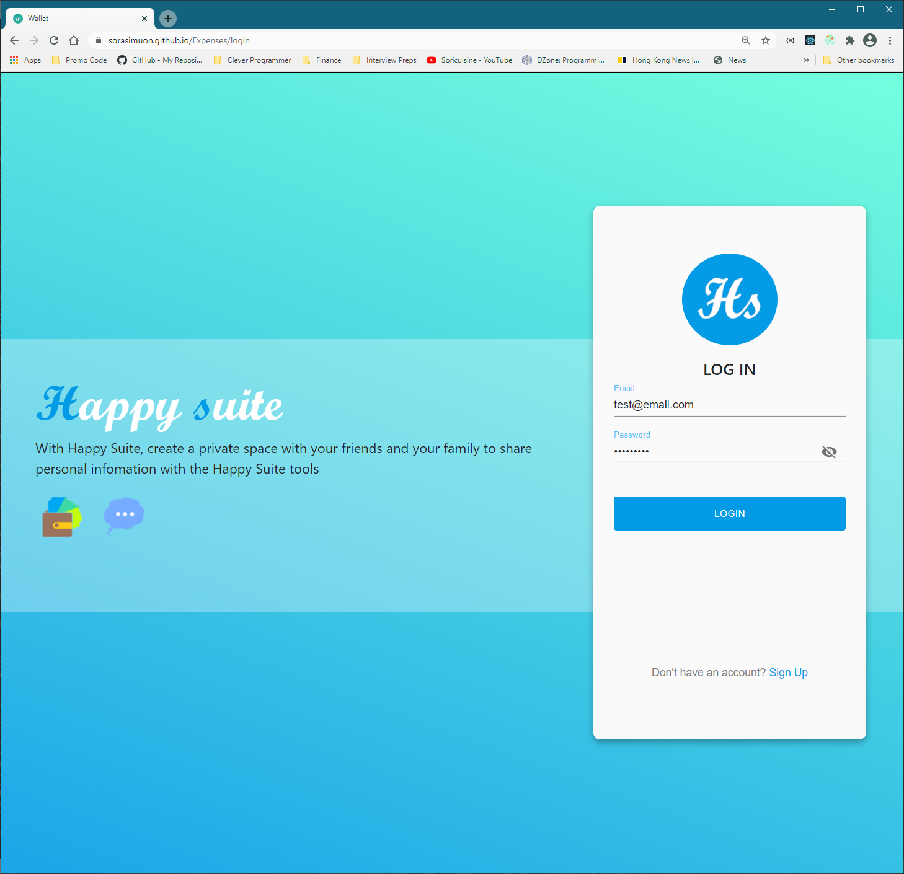
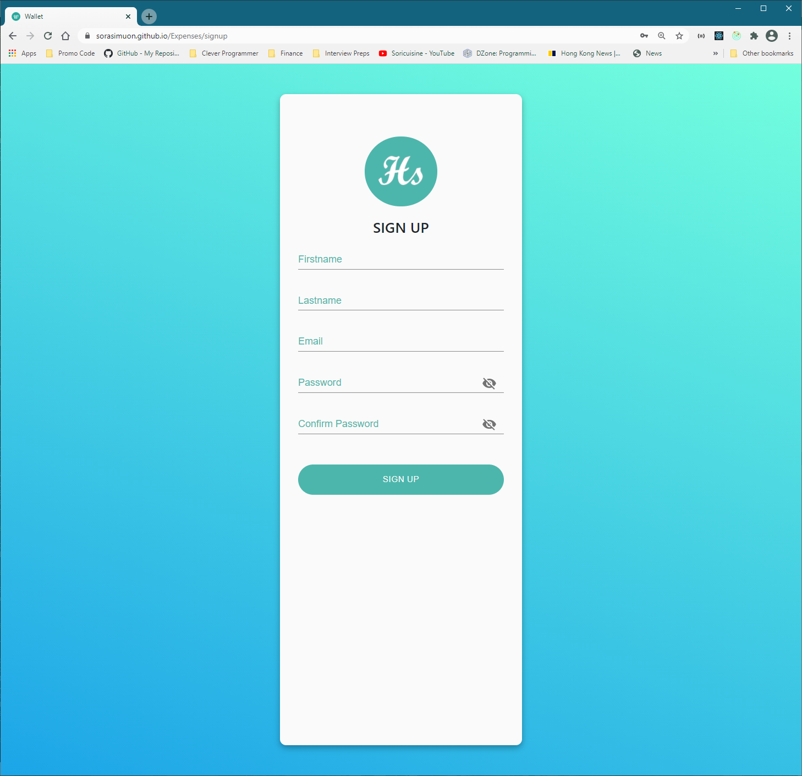
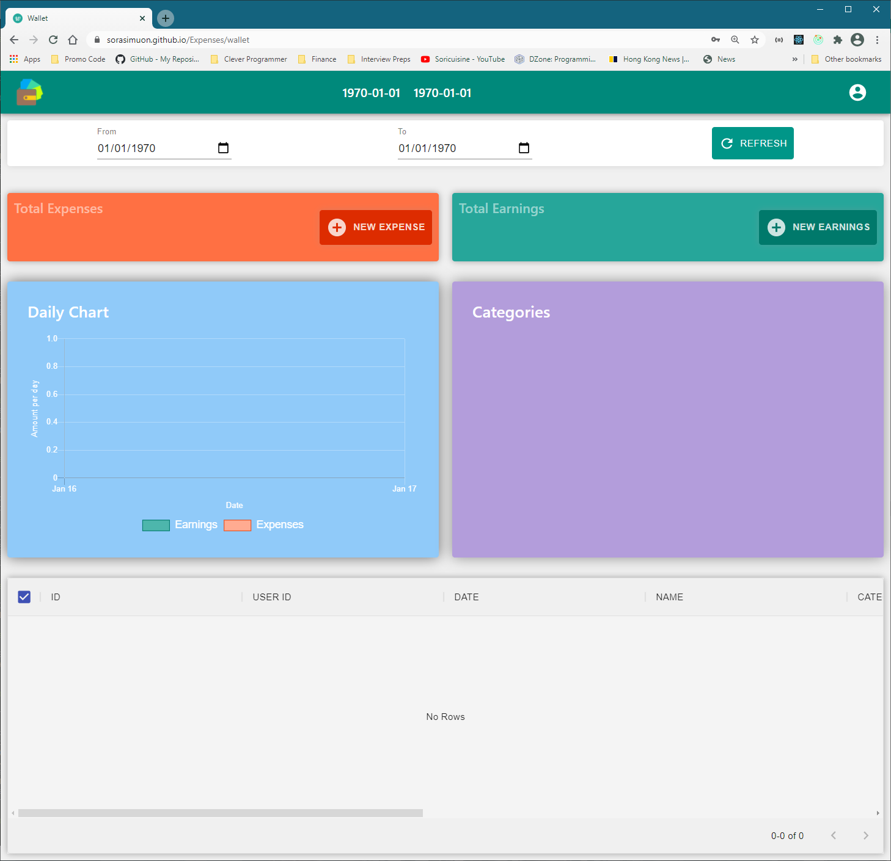
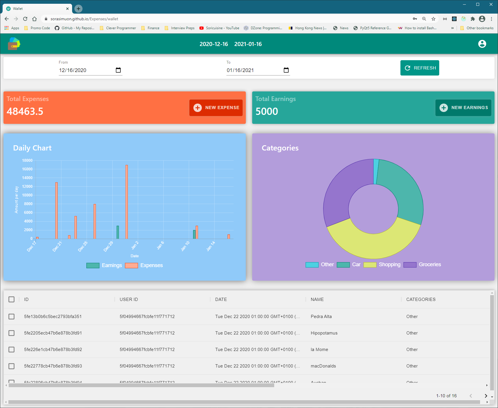
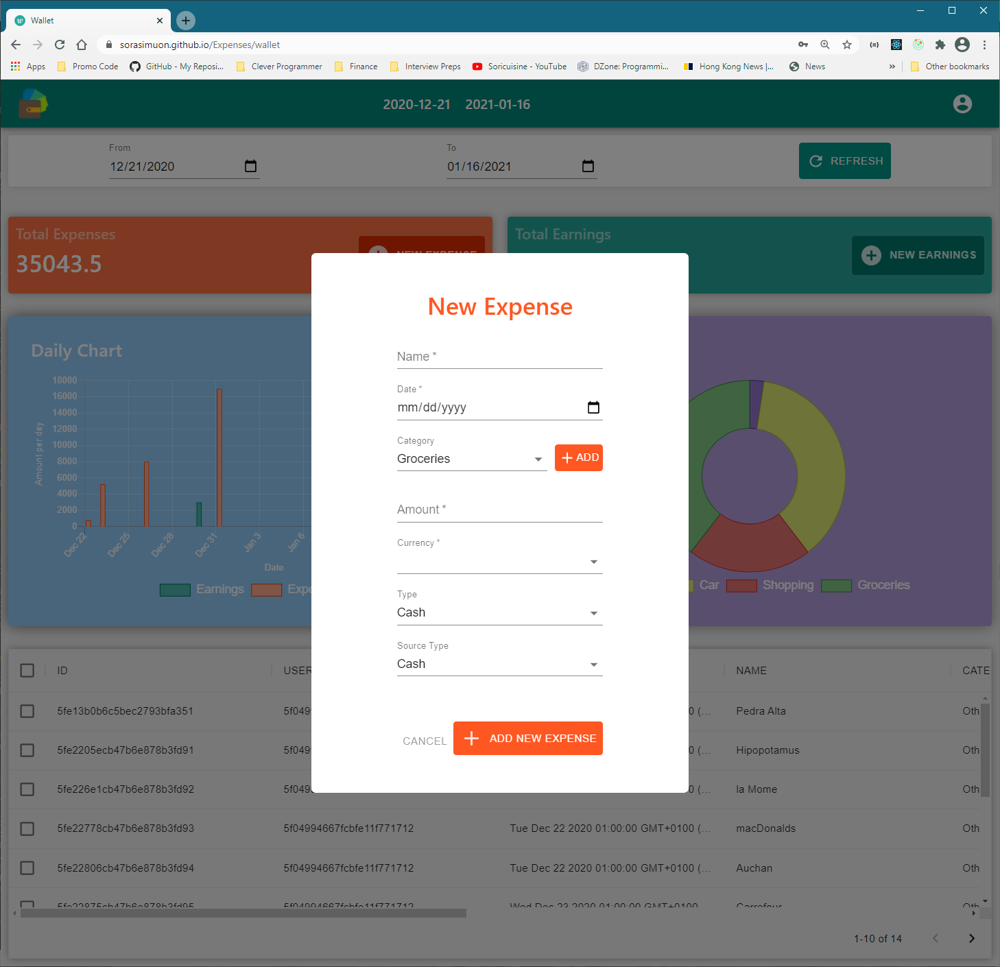
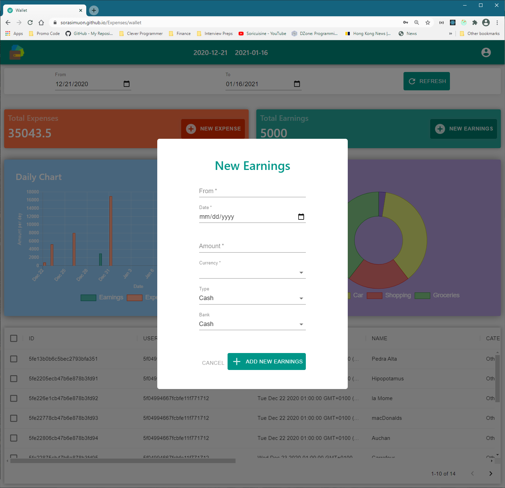

# Expenses

A front end aplication where the user can access and tracks his daily expenses. 

It connects to a backend service written in Python/Flask to collect data from a MongoDB.

Live Preview: https://sorasimuon.github.io/Expenses/

## Stack
Javascript

Framework : Reactjs

Middleware : Redux for state data store

GUI library: Material UI, Chartjs

Testing: testing-library/react

## Visuals

SignIn page: 

Credential tests: 

username : "test@email.com"

password: "doudoushi"

SignUp page:

Wallet page:

Data loaded from backend service Expenses (https://github.com/sorasimuon/Service_Expenses):

Chartjs library used for plotting data

New Expense modal:

New Earnings modal:

